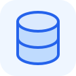

  

<h1 align="center">Mini Database</h1>

A small, file-backed key-value database written in C++.

## Features

- Simple CLI: `add`, `get`, `set`, `remove`, and `list`.
- Persistent storage in a readable `key=value` text file.
- Duplicate-key checks when adding entries.
- No database server or external libraries needed.
